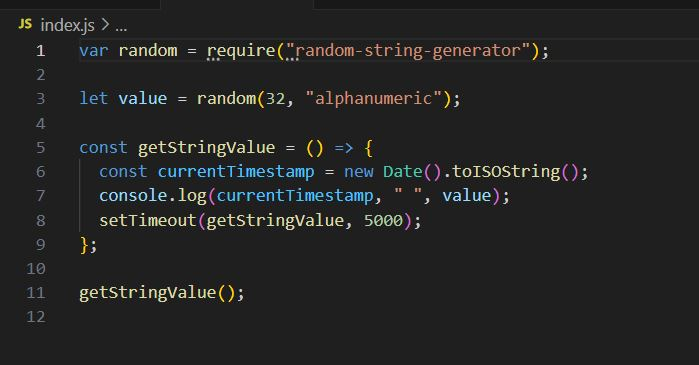
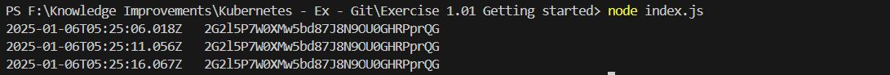
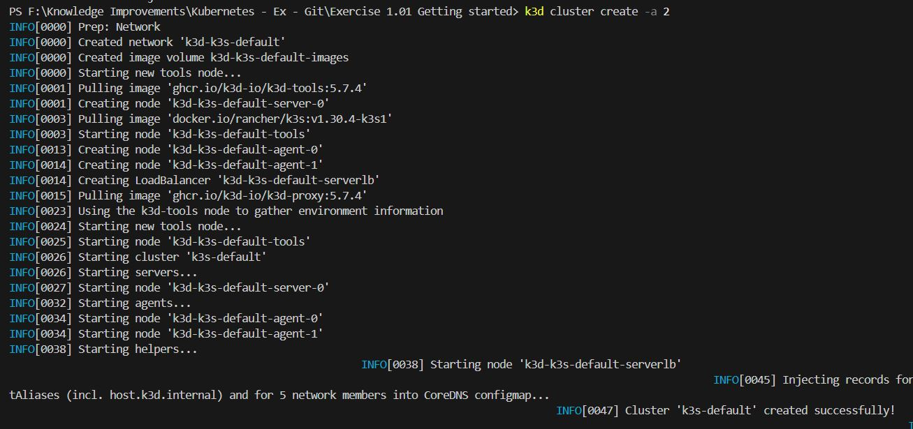

# Exercise 1.01: Getting started

## 1. Create an application that generates a random string on startup, stores this string into memory, and outputs it every 5 seconds with a timestamp.

## 2. Deploy it into your Kubernetes cluster and confirm that it's running with kubectl logs ...

1. create a k3d cluster : "k3d cluster create -a 2"

