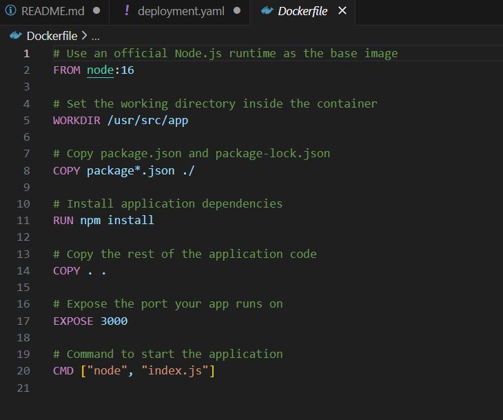
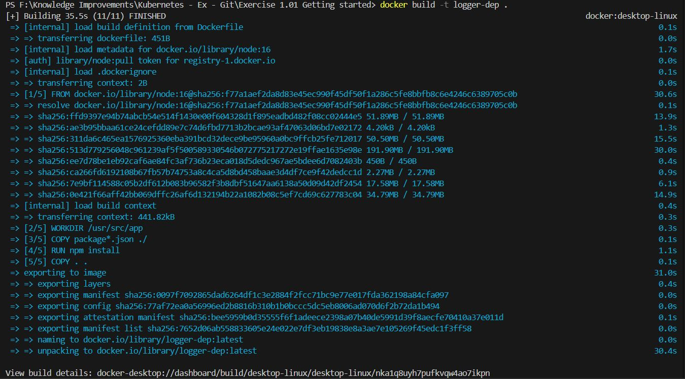

# Exercise 1.01: Getting started

## 1. Create an application that generates a random string on startup, stores this string into memory, and outputs it every 5 seconds with a timestamp.

## 2. Deploy it into your Kubernetes cluster and confirm that it's running with kubectl logs ...

## You will keep building this application in the future exercises. This application will be called "Log output".

1. create a k3d cluster : "k3d cluster create -a 2"

2. Generate the docker file to create a docker image.

3. build docker image for the "Log output" (This image is called "logger-dep")

